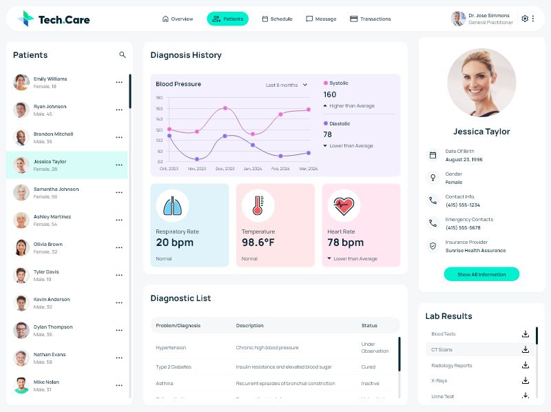

# 💻 Healthcare Dashboard

A modern and responsive **Healthcare Dashboard Web Application** designed to manage and visualize healthcare data efficiently.

---

## 🚀 Live Demo

🔗 https://prajwalchaudhari60.github.io/HealthCare-Dashboard/

---

## 📸 Screenshots

<!-- Add your screenshots here -->



---

## ✨ Features

* 📊 Interactive Dashboard UI
* 📱 Fully Responsive Design
* 🧑‍⚕️ Healthcare Data Visualization
* ⚡ Fast and Clean User Interface
* 🎨 Modern UI/UX Design

---

## 🛠 Tech Stack

* 🌐 HTML
* 🎨 CSS
* ⚙️ JavaScript

---

## 🧪 Testing (QA Perspective)

* ✔ Manual Testing
* ✔ UI Testing
* ✔ Cross-browser Testing
* ✔ Bug Reporting

---

## 📂 Project Structure

```
HealthCare-Dashboard/
│── index.html
│── style.css
│── script.js
│── assets/
│── screenshots/
```

---

## 🔧 Installation & Setup

1. Clone the repository

```
git clone https://github.com/prajwalchaudhari60/HealthCare-Dashboard.git
```

2. Open the project folder

3. Run `index.html` in your browser

---

## 📌 Future Improvements

* 🔐 Add Authentication
* 📡 API Integration
* 📊 Real-time Data
* 📱 Mobile Optimization Enhancements

---

## 👨‍💻 Author

**Prajwal Chaudhari**

* 🔗 GitHub: https://github.com/prajwalchaudhari60
* 💼 LinkedIn: https://www.linkedin.com/in/prajwal-chaudhari-55190a261

---

## ⭐ Support

If you like this project, give it a ⭐ on GitHub!
